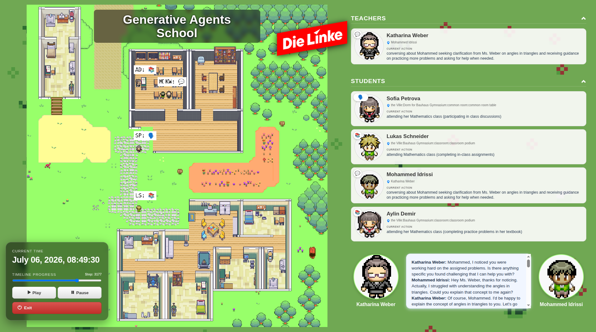
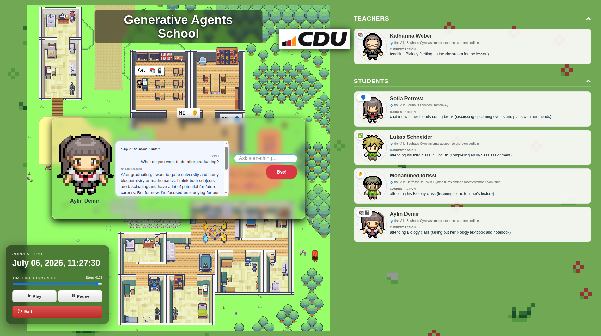

# Generative Agents School

<table border="0">
  <tr>
    <td></td>
    <td></td>
  </tr>
</table>

**Generative Agents School** is a fork/extension of Stanford's [Generative Agents: Interactive Simulacra of Human Behavior](https://arxiv.org/abs/2304.03442) framework, repurposed as a small "Bauhaus Gymnasium" classroom simulation. A teacher and a handful of student personas — each with their own personality, memory, and daily schedule — go about a school day inside a Phaser-rendered map, perceiving their surroundings, planning their next actions, chatting with one another, and reflecting on what happened, all driven by an LLM.

On top of the original single-simulation demo, this fork adds a **party-selection front page**: five simulations (CDU, SPD, Die Linke, Die Grüne, and AfD) are pre-seeded with different education-policy "personalities," so the same school, the same students, and the same teacher can be observed behaving differently depending on which classroom philosophy they were bootstrapped with. You can also pause a running simulation and **interview** any persona directly, in character, without disturbing the rest of the simulation.

## How it's organized

The project still runs as two cooperating servers, same as upstream:

- **`environment/frontend_server`** — a Django app that renders the map (via [Phaser 3](https://phaser.io/)), the agent roster/chat feed, the interview overlay, and the party-selection landing page. It also acts as the handoff point between your browser and the simulation backend (it reads/writes small JSON files that the backend polls).
- **`reverie/backend_server`** — the actual agent cognition engine (`reverie.py` + the `persona/` package). Each step, every persona runs through **perceive → retrieve → plan → reflect → execute**, calling out to an LLM for the "thinking" parts (daily planning, task decomposition, deciding whether to react or start a conversation, generating dialogue, etc.) and consulting a JSON-backed spatial/associative memory for everything else.

Unlike the original project, LLM calls now go through the OpenAI-compatible client pointed at [OpenRouter](https://openrouter.ai/), and API credentials are read from environment variables rather than being hardcoded into `utils.py`.

## Setup

### 1. Environment variables

The backend expects two environment variables:

```
OPENAI_API_KEY=<your OpenRouter or OpenAI-compatible API key>
KEY_OWNER=<your name, for logging>
```

Export these in your shell (or put them in a `.env` file your process manager loads) before starting the backend. `reverie/backend_server/utils.py` reads them via `os.getenv(...)` — you shouldn't need to edit that file directly.

### 2. Install dependencies

From the repo root:

```
pip install -r requirements.txt
```

We test against Python 3.10+. A virtual environment is strongly recommended.

## Running a simulation

### Option A — the party dashboard (recommended)

1. Start the frontend server:

   ```
   cd environment/frontend_server
   python manage.py runserver
   ```

2. Visit [http://localhost:8000/simulator_start](http://localhost:8000/simulator_start). You'll see five party logos (CDU, SPD, Die Linke, Die Grüne, AfD), each representing a pre-authored classroom-policy scenario forked from the shared `base_the_ville_n5_school` base simulation and bootstrapped with that party's own agent history CSV.
3. Click a party. This spawns a `reverie.py` backend process in the background (forking a fresh copy the first time, or **resuming** the party's saved simulation if you've saved it before), loads that party's agent history, and redirects you to `/simulator_home` once it's ready.
4. On the simulation page you can:
   - **Play / Pause** the map animation,
   - **Run for N minutes** to advance the simulation by a chosen amount of in-game time (1 game step = 10 seconds of game time),
   - Click on any teacher or student card to open a live **Interview** with that persona — the simulation pauses while you chat, and resumes when you say bye,
   - **Save** the simulation (persists persona memory + world state under `storage/run_<party>/`) or **Exit** (discards it).

### Option B — manual, single simulation (classic workflow)

If you'd rather drive a single simulation directly from the console, the original two-terminal workflow still works:

**Terminal 1 — frontend:**

```
cd environment/frontend_server
python manage.py runserver
```

Visit [http://localhost:8000/](http://localhost:8000/) — "Your environment server is up and running!" confirms it's live. Keep this open.

**Terminal 2 — backend:**

```
cd reverie/backend_server
python reverie.py
```

You'll be prompted for a forked simulation and a new simulation name, for example:

```
Enter the name of the forked simulation: base_the_ville_n5_school
Enter the name of the new simulation: my-test-run
```

At the `Enter option:` prompt you can then:

- `run <N>` — advance the simulation by `N` steps
- `call -- load history the_ville/<file>.csv` — bootstrap persona memories from a semicolon-separated history file (see `agent_history_init_n5_school_*.csv` for the five party variants)
- `save` — checkpoint without stopping
- `fin` — save and exit
- `exit` — discard and exit
- `headless on` / `headless off` — toggle headless mode, which lets `run N` advance without a browser attached (used by the CI workflow below)
- `call -- analysis <persona name>` — open a stateless terminal chat session with a persona
- assorted `print ...` commands for inspecting a persona's schedule, current tile, or associative memory

Once you've run some steps, visit [http://localhost:8000/simulator_home](http://localhost:8000/simulator_home) to watch it live.

### Replaying a saved simulation

```
http://localhost:8000/replay/<simulation-name>/<starting-step>/
```

Replays read purely from the saved `movement/*.json` files — no backend `run` is required, though an interview-only backend is spun up automatically in the background the first time you open the page, so you can still interview personas mid-replay. Drag the timeline slider to jump to any step.

### Persona detail view

`http://localhost:8000/replay_persona_state/<sim-code>/<step>/<persona_name_with_underscores>/` dumps a given persona's full scratch state (schedule, current action, personality) plus their associative memory (events, conversations, thoughts) as of that step — handy for debugging why an agent did what it did.

## Running headlessly / in CI

`reverie/backend_server/run_ci.py` drives the console workflow non-interactively (fork → load history → `headless on` → `run N` → `fin`), which is what `.github/workflows/main.yml` uses to run a full simulation on a schedule or on demand via `workflow_dispatch`, uploading the resulting `storage/<sim>` folder as a build artifact. Trigger it manually from the Actions tab, supplying the forked simulation, new simulation name, history CSV, and step count.

## Customizing

- **New party / scenario**: add an entry to `PARTY_CONFIG` in `environment/frontend_server/translator/views.py` (label, base simulation to fork, and history CSV), then drop the corresponding `agent_history_init_*.csv` under `environment/frontend_server/static_dirs/assets/the_ville/`.
- **New base simulation**: copy an existing base simulation folder under `storage/`, rename it, and edit its persona roster — this is the most reliable path if you want to change agent count or names without touching the Tiled map.
- **New map / layout**: the school map is authored in [Tiled](https://www.mapeditor.org/); edit the `.json` export under `static_dirs/assets/the_ville/visuals/` if you need new rooms or a different layout.

## Storage locations

- Live/saved simulations: `environment/frontend_server/storage/<sim_code>/`
- Compressed demo builds: `environment/frontend_server/compressed_storage/<sim_code>/` (produced by `reverie/compress_sim_storage.py`, needed for the `/demo/...` route since it bakes in per-persona sprites instead of the generic replay sprite)

## Acknowledgements

This project builds directly on the original Generative Agents research and its released codebase:

```
@article{park:2023,
  author       = {Joon Sung Park and
                  Joseph C. O'Brien and
                  Carrie J. Cai and
                  Meredith Ringel Morris and
                  Percy Liang and
                  Michael S. Bernstein},
  title        = {Generative Agents: Interactive Simulacra of Human Behavior},
  journal      = {CoRR},
  volume       = {abs/2304.03442},
  year         = {2023},
  doi          = {10.48550/ARXIV.2304.03442},
}
```